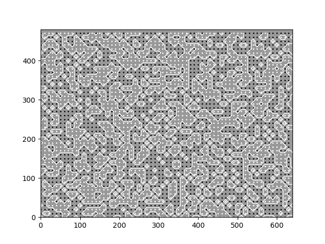
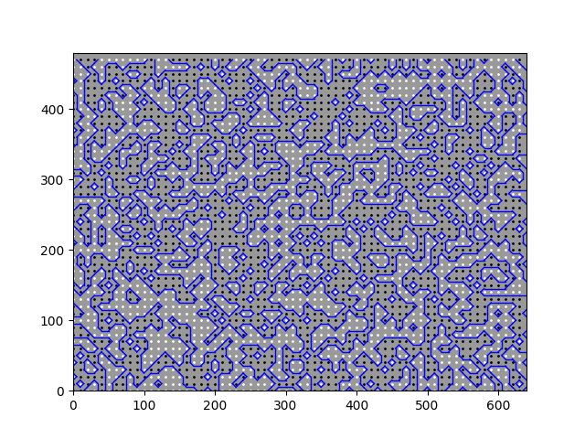
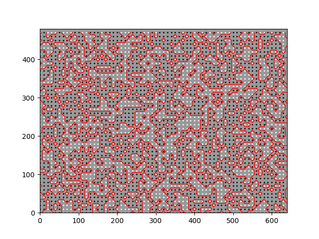

# Marching Squares

## Description
This is a simple implementation of marching squares algorithm in Computer Graphics, in python.
The code `main.py` creates 2d terrains using the algorithm and shows them as a plot. The code contains different value systems for nodes of squares (binary as 0 and 1, and float as 0.0 to 1.0) and different ways of assigning them values (using simple uniform random generator, or using different kinds of noise). The code also contains a simple implementation of some noise generators.

## Usage
```
python3 -m venv ./venv
source ./venv/bin/activate
pip install -r requirements.txt
```
and then:
```
python3 main.py
```

## Example outputs:

### These are sample outputs for binary values of square nodes and using uniform random generator for assigning values to nodes:





